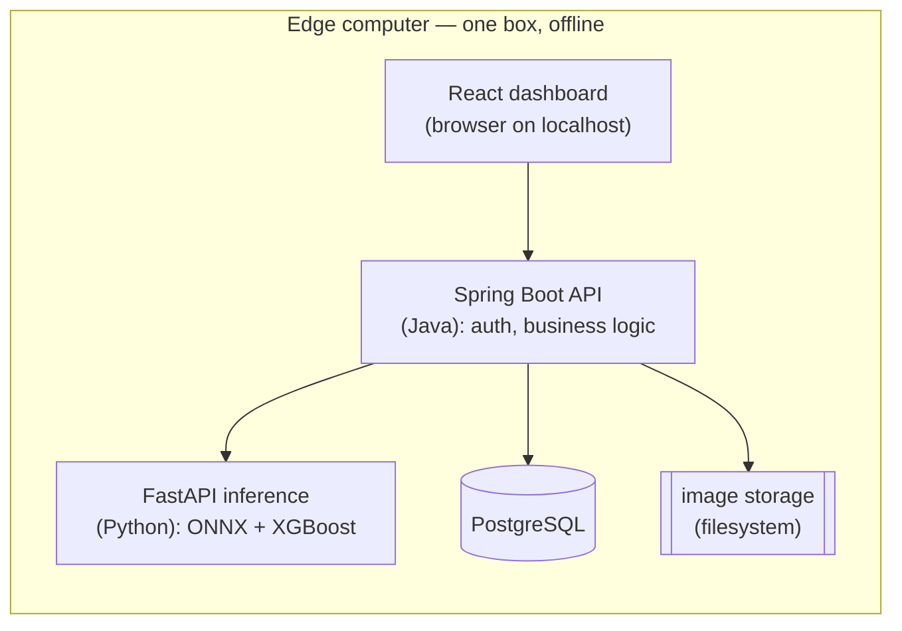

# Drishti-AI — Full-Stack App Build Plan

> **Purpose:** turn the existing proof-of-concept (Python models + static React dashboard) into a real, multi-user, **offline edge** full-stack application using a **Java (Spring Boot) backend + a Python inference service**.
>
> **Honest framing:** the software here is a few weeks of work and keeps every measured result intact. The genuinely hard part (real cameras/sensors) is pilot-time work and is flagged as such. Build the MVP first; treat everything marked *Later* / *Skip* as optional.

---

## 0. Table of contents
1. [Goal & scope](#1-goal--scope)
2. [Architecture (Option A — hybrid, edge-local)](#2-architecture-option-a--hybrid-edge-local)
3. [Tech stack](#3-tech-stack)
4. [Repository structure](#4-repository-structure)
5. [Data model](#5-data-model)
6. [API design](#6-api-design)
7. [Module → implementation mapping](#7-module--implementation-mapping)
8. [Phased build plan (do this in order)](#8-phased-build-plan-do-this-in-order)
9. [Three features worth building](#9-three-features-worth-building)
10. [Deployment (edge-local, offline)](#10-deployment-edge-local-offline)
11. [Hardware roadmap (pilot-time)](#11-hardware-roadmap-pilot-time)
12. [Enhancement backlog (do now / later / skip)](#12-enhancement-backlog)
13. [Effort & timeline](#13-effort--timeline)
14. [Risks & honest notes](#14-risks--honest-notes)

---

## 1. Goal & scope

**What we're building:** one deployable system where a shop can log in, run defect inspection (with a live Hindi alert), see tool-wear predictions and demand forecasts, and view it all on one dashboard — running **on a single computer with no internet**.

**MVP (build this first):**
- Java backend: REST APIs + PostgreSQL + JWT auth (2 roles) + image upload
- Python inference service: reuses existing model code (vision + XGBoost + templates)
- React dashboard: pointed at the APIs + one new **image-upload screen**
- Everything packaged with **Docker Compose** (`docker compose up`)

**Explicitly NOT in the MVP:** real camera/sensor hardware, multi-tenant SaaS, cloud sync, Kubernetes, message queues, monitoring stacks. (See §12.)

---

## 2. Architecture (Option A — hybrid, edge-local)

Java owns the application (APIs, DB, auth, serving the UI). A thin Python service does only the ML math, reusing the **already-validated** Python code so the numbers never drift.



**Why hybrid, not pure Java:** re-implementing M4's feature engineering (lags, rolling means, signed-log) in Java risks silently changing your forecast accuracy. Keep the ML in Python; let Java orchestrate. (You *may* move the vision model to in-JVM ONNX later — its preprocessing is simple — but it's optional.)

---

## 3. Tech stack

| Layer | Choice | Notes |
|---|---|---|
| Backend | **Java 17+ / Spring Boot 3** | Web, Data JPA, Security |
| Auth | Spring Security + **JWT** | roles: `OPERATOR`, `OWNER` |
| Database | **PostgreSQL** | replaces `events.json` |
| ML service | **Python + FastAPI + Uvicorn** | wraps existing model code |
| Vision runtime | ONNX Runtime (Python) | reuse `casting_mobilenetv2_proper.onnx` |
| Tabular models | XGBoost (Python) | reuse M3/M4 saved models |
| Frontend | **existing React + Vite** | swap data source to APIs |
| Packaging | **Docker + Docker Compose** | 4 services |
| Build | Maven (Java), pip/venv (Python), npm (React) | |

---

## 4. Repository structure

Proposed layout (new `app/` folder alongside the existing modules):

```
drishti-ai/
├─ app/
│  ├─ backend/                 # Spring Boot (Java)
│  │  ├─ src/main/java/com/drishti/
│  │  │  ├─ DrishtiApplication.java
│  │  │  ├─ config/            # security, CORS, JWT
│  │  │  ├─ inspection/        # M1+M2 controller, service, entity, repo
│  │  │  ├─ maintenance/       # M3
│  │  │  ├─ forecast/          # M4
│  │  │  ├─ auth/              # users, login, roles
│  │  │  └─ ml/                # client that calls the Python service
│  │  ├─ src/main/resources/application.yml
│  │  └─ pom.xml
│  ├─ inference/               # Python FastAPI
│  │  ├─ main.py               # endpoints
│  │  ├─ vision.py             # imports module1 model/infer code
│  │  ├─ maintenance.py        # imports module3 code
│  │  ├─ forecast.py           # imports module4 code
│  │  ├─ alerts.py             # imports module2 template logic
│  │  └─ requirements.txt
│  ├─ frontend/                # the existing dashboard, API-connected
│  └─ docker-compose.yml
├─ module1_cv_defect/ …        # existing code + models (reused by inference/)
├─ module2_vernacular_alert/ …
├─ module3_predictive_maintenance/ …
└─ module4_demand_forecasting/ …
```

The Python `inference/` service **imports the existing module code** — no rewrite of the ML.

---

## 5. Data model

Turn `events.json` into real tables. This is the "shared schema" made concrete.

| Table | Key columns |
|---|---|
| `users` | id, username, password_hash, role (`OPERATOR`/`OWNER`) |
| `inspections` | id, part_id, timestamp, pass_fail, defect_type, confidence, inference_ms, alert_hi, image_path, **operator_verdict** (for feedback), **was_correct** |
| `tools` | id, tool_ref, status |
| `sensor_readings` | id, tool_id, cycle, predicted_rul, actual_rul, wear_alert, timestamp |
| `forecasts` | id, category, week, predicted_demand, lower_p10, upper_p90, wape_pct |
| `kpis` | id, total_inspections, pass_count, fail_count, pass_rate, avg_inference_ms, updated_at |
| `settings` | id, defect_threshold, rul_alert_threshold (configurable) |

JPA entities mirror these tables one-to-one.

---

## 6. API design

All under `/api`. JWT required except `/auth/*`.

**Auth**
- `POST /auth/register`, `POST /auth/login` → returns JWT

**Module 1 + 2 — inspection**
- `POST /inspections` — multipart image upload → runs vision + alert, stores row, returns `{pass_fail, defect_type, confidence, inference_ms, alert_hi}`
- `GET /inspections?filter=all|pass|fail` — list
- `GET /kpis` — dashboard numbers
- `PATCH /inspections/{id}/feedback` — operator marks the call right/wrong (feedback loop)

**Module 3 — maintenance**
- `POST /maintenance/predict` — sensor feature row → predicted RUL + alert flag
- `GET /maintenance/tools` — per-tool status + history

**Module 4 — demand**
- `POST /forecast/run` — (re)compute forecasts
- `GET /forecast/categories` — categories + history + interval

**Settings**
- `GET /settings`, `PUT /settings` — thresholds (owner only)

**Python inference service (internal, called by Java only)**
- `POST /predict/vision` (image) → class, confidence, ms
- `POST /predict/maintenance` (features) → rul
- `POST /forecast` (category, horizon) → point + P10/P90

---

## 7. Module → implementation mapping

| Module | Java side | Python side | Reuses existing file |
|---|---|---|---|
| M1 vision | `/inspections` endpoint, stores result + image | ONNX inference | `module1.../infer.py`, `model.py`, `dataset.py` |
| M2 alert | can be pure Java (load templates, substitute) **or** call Python | template fill | `module2.../alerts.py`, `templates/alerts_hi.json` |
| M3 maintenance | `/maintenance/*` | XGBoost predict | `module3.../train.py` load + predict |
| M4 demand | `/forecast/*`, scheduled refresh | XGBoost + quantiles + features | `module4.../forecast.py`, `features.py` |

> **Tip:** M2 is trivial to port to Java (JSON templates + string substitution). Doing so removes one Python round-trip. Optional.

---

## 8. Phased build plan (do this in order)

### Phase 0 — Design & setup  *(0.5 wk)* — ✅ done
- [x] Finalize the data model (§5) and API list (§6).
- [x] Create `app/` folders. Install JDK 17, Maven. *(Docker deferred to Phase 6 — needs WSL2.)*
- [x] Postgres 16 installed as the `postgresql-x64-16` Windows service on the default
      port 5432, auto-starting with the machine.

### Phase 1 — Spring Boot skeleton + DB  *(1 wk)* — ✅ done
- [x] Maven project with Web, WebFlux, JPA, Validation, Actuator, PostgreSQL.
- [x] Entities + repositories: `inspections`, `tools`, `sensor_readings`, `forecasts`, `settings`.
      *(`users` deferred to Phase 4 where it's first used. KPIs are computed from
      `inspections` rather than cached in a table — a stored copy would go stale.)*
- [x] App connects; tables auto-created; `/actuator/health` returns `UP`.
- [x] Seeder loads `dashboard/src/data/events.json` on first run (24 inspections,
      5 tools, 283 readings, 120 forecast points) so a fresh install has real data.

### Phase 2 — Python inference service  *(0.5–1 wk)* — ✅ done
- [x] FastAPI app with the 3 `/predict` endpoints, plus two discovery endpoints.
- [x] Each imports the existing module code and loads the saved model **once** at startup
      (vision runs on CUDA).
- [x] All three verified by curl against real model artifacts.

### Phase 3 — Wire Java → Python + core APIs  *(1–1.5 wk)* — ✅ done
- [x] `ml/InferenceClient` (WebClient) calls the Python service, translating its
      errors so a bad request surfaces as 400 rather than 500.
- [x] `/inspections` (upload → Python vision → Hindi alert → save → return), verified end-to-end.
- [x] `/maintenance/*` and `/forecast/*`.
- [x] `/kpis` (aggregate from `inspections`).
- [x] Module 2 ported to Java (`alert/AlertService`), reading the same templates file.

### Phase 4 — Auth  *(0.5–1 wk)*
- [ ] JWT login/register; password hashing (BCrypt).
- [ ] Roles: `OPERATOR` (inspect + alerts), `OWNER` (all + settings).
- [ ] Secure endpoints.

### Phase 5 — Connect the frontend  *(1 wk)* — ✅ mostly done
- [x] Replaced `import events.json` with `fetch()` calls (`dashboard/src/api.js`),
      which also adapts camelCase API responses to the field names the existing
      components read — so no component rewrite was needed.
- [x] **Image-upload screen** (§9.1) — drag-drop → live model → Hindi alert.
- [x] Vite dev proxy `/api` → `:8080`, so the browser is same-origin.
- [ ] Login screen + role-aware navigation — waiting on Phase 4.

> Published model metrics (benchmarks, WAPE, M1 accuracy) still come from
> `events.json`. They're measured paper results, not runtime state.

### Phase 6 — Containerize  *(0.5 wk)*
- [ ] Dockerfiles for backend, inference, frontend.
- [ ] `docker-compose.yml` with 4 services (§10).
- [ ] `docker compose up` runs the whole system on `localhost`.

### Phase 7 — Polish  *(0.5–1 wk)*
- [ ] Adjustable defect threshold + RUL threshold in Settings (§9).
- [ ] Operator feedback capture (§9).
- [ ] Seed/demo data script so a fresh install shows something.

---

## 9. Three features worth building

### 9.1 Interactive image upload  ⭐ highest value-per-effort
A screen where you drag in a part photo → get pass/fail + confidence + Hindi alert live. Turns the dashboard from a *report* into a *product*, and makes the demo interactive.
- Frontend: file input → `POST /inspections` (multipart) → show result card.
- Backend: already covered by the `/inspections` endpoint.

### 9.2 Adjustable defect threshold
Let the owner tune how strict the pass/fail cutoff is (trade more false alarms for fewer missed defects). Directly addresses the project's own limitation **L4** (safety-critical false negatives).
- Store in `settings`; apply in the inspection service before deciding pass/fail.

### 9.3 Operator feedback loop  ⭐ the only real moat
When an operator marks a prediction wrong, store the image + correction (`PATCH /inspections/{id}/feedback`). Over a pilot this becomes **proprietary data no competitor has** — and later, retraining fuel. Build the *capture* now; retraining comes later.

---

## 10. Deployment (edge-local, offline)

Everything runs on one machine. No internet needed at run time.

`app/docker-compose.yml` (skeleton):
```yaml
services:
  db:
    image: postgres:16
    environment: [POSTGRES_DB=drishti, POSTGRES_PASSWORD=***]
    volumes: [dbdata:/var/lib/postgresql/data]
  inference:
    build: ./inference
    # loads ONNX + XGBoost models at startup
  backend:
    build: ./backend
    depends_on: [db, inference]
    environment: [DB_URL=jdbc:postgresql://db:5432/drishti, INFERENCE_URL=http://inference:8000]
  frontend:
    build: ./frontend      # nginx serving the built React app
    ports: ["8080:80"]
volumes: { dbdata: {} }
```
- Shop opens `http://localhost:8080`.
- For a shareable cloud demo, deploy the same compose file to a cheap VM (Render / Railway / Lightsail) — but note that breaks the "offline" claim, so keep it for demos only.

---

## 11. Hardware roadmap (pilot-time)

The software above simulates devices via the upload UI and the existing replay script. Real hardware is a separate, pilot-stage effort:

- **Camera** → a small capture service (Python) grabs frames and POSTs to `/inspections`. Needs a real industrial/USB camera.
- **Vibration + current sensors** → an **MQTT** gateway publishes readings; a consumer feeds `/maintenance/predict`. Your existing `streaming_replay.py` becomes a real MQTT consumer.
- **Edge device** → provision the Docker Compose stack on a fanless mini-PC at the shop.

Do **not** let hardware block the software build — it needs physical devices and a real pilot site.

---

## 12. Enhancement backlog

| Item | Verdict |
|---|---|
| Interactive upload, adjustable threshold, feedback capture | ✅ **Do now** (§9) |
| Scheduled forecast refresh (`@Scheduled`) | ✅ Easy win |
| Role dashboards (operator vs owner) | ✅ Do |
| Live inspection feed (SSE/WebSocket) | 🟡 Later — nice demo |
| PDF/Excel owner reports | 🟡 Later |
| Multi-class defect typing (beyond pass/fail) | 🟡 Later (templates already support it) |
| Vision model in-JVM ONNX (drop Python for M1) | 🟡 Optional |
| TimescaleDB for sensor data | 🟡 Only with real streaming |
| CI/CD (GitHub Actions) | 🟡 Optional, good practice |
| Drift monitoring / model registry (MLflow) | ⛔ Not yet — needs real data |
| Redis, Kafka, Kubernetes, ELK, Prometheus | ⛔ Over-engineering at this scale |
| Multi-tenant SaaS | ⛔ Not before one pilot |
| WhatsApp/SMS alerts | ⛔ Breaks offline — cloud-mode only |

---

## 13. Effort & timeline

Solo, part-time estimates:

| Scope | Time |
|---|---|
| MVP (Phases 0–6) | **~3–5 weeks** |
| + the three features (§9) + role dashboards | **+2–3 weeks** |
| Hardware integration | pilot-time, weeks more, needs devices |

---

## 14. Risks & honest notes

- **Result drift:** the #1 risk in any rewrite. Keeping ML in Python (hybrid) avoids it. If you ever port features to Java, diff the outputs against the Python version on the same inputs before trusting them.
- **Scope creep:** the backlog is tempting. Ship the MVP first; a running system beats a perfect architecture.
- **Priority vs the pilot:** this build is great for learning Java full-stack, a production-grade demo, and your resume/GitHub — but a *real customer/pilot* matters more for the startup. Don't let the rebuild delay getting into one shop.
- **Offline is the thesis:** every choice here preserves "runs on one box, no cloud." Guard that — it's your differentiation.
- **Public code:** the repo is already public; fine for a product, but keep in mind for any patent timing.

---

*This document is the build blueprint. Start at Phase 0 and work down. Update the checkboxes as you go.*
