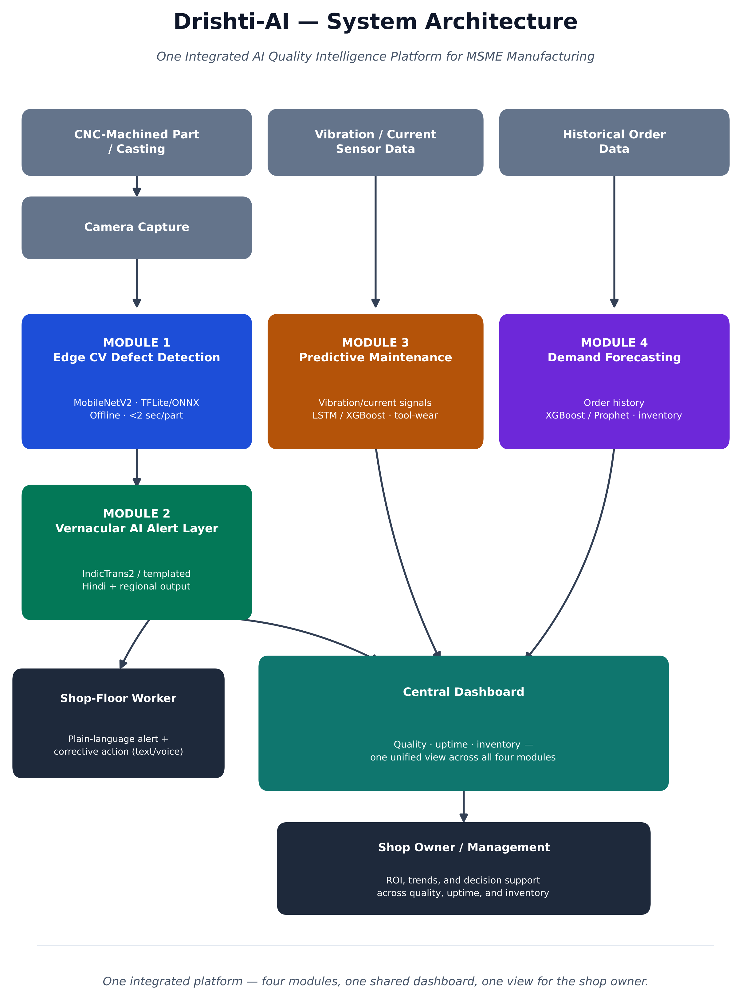
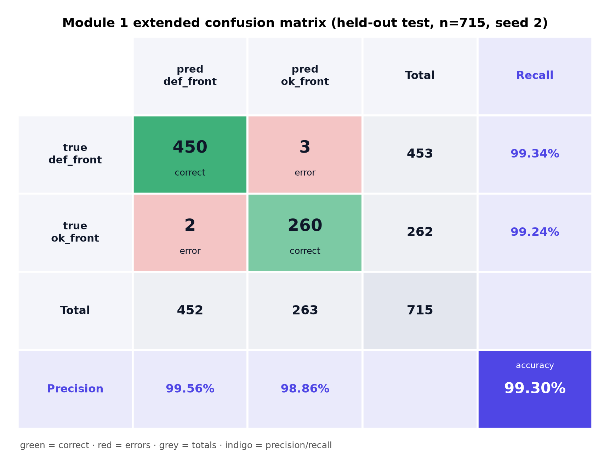
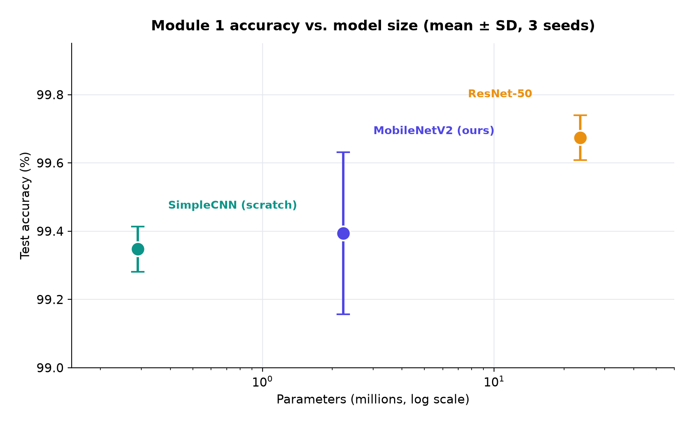
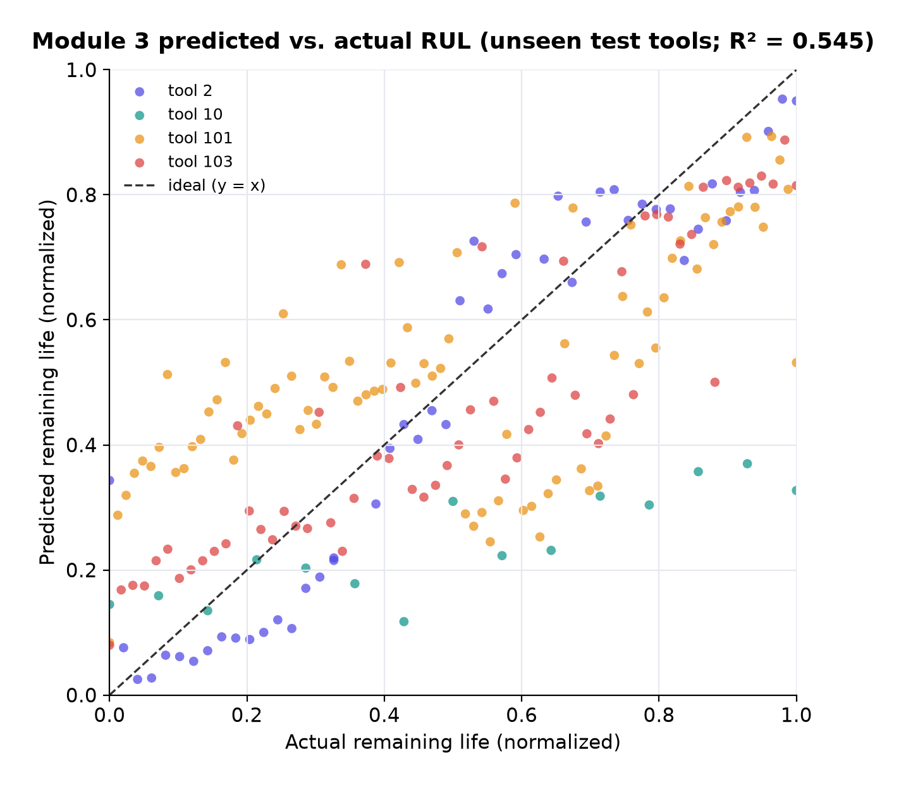
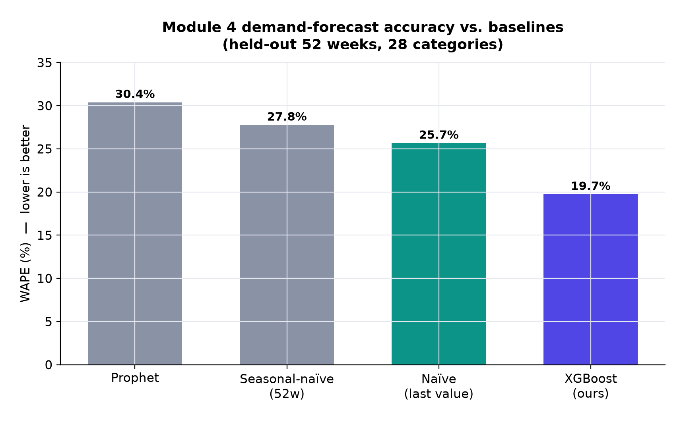
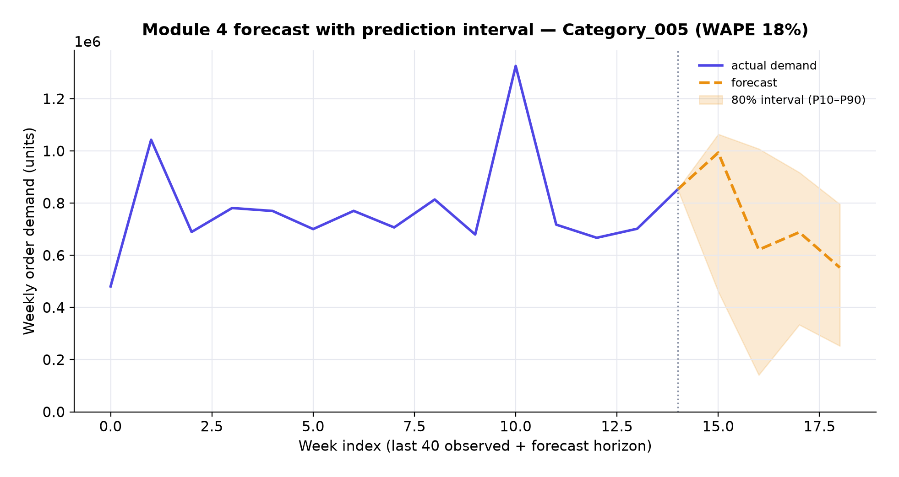

<h1 align="center">🔍 Drishti-AI</h1>

<p align="center">
  <b>An offline, four-in-one AI system for small manufacturers — quality, maintenance, and demand, on one dashboard, with no cloud.</b>
</p>

<p align="center">
  <a href="https://yashwanth-crypto.github.io/drishti-ai/">
    
  </a>
</p>

<p align="center">
  
  
  
  
  
  
  
</p>

---

## 📑 Contents

- [Why this exists](#-why-this-exists)
- [System at a glance](#-system-at-a-glance)
- [Results in one table](#-results-in-one-table)
- [The four modules](#-the-four-modules)
- [The dashboard](#-the-dashboard)
- [Tech stack](#-tech-stack)
- [Run it yourself](#-run-it-yourself)
- [Repository layout](#-repository-layout)
- [Honest limitations](#-honest-limitations)
- [Author](#-author)

---

## 🎯 Why this exists

Most of India's factories are small shops. The AI tools that cut defects, downtime, and
wasted stock are built for big plants — they assume cloud servers, GPUs, and staff who
read English dashboards. A shop that casts or machines a few thousand parts a month has
none of that.

**Drishti-AI** is built for that shop. Four parts run on an ordinary CPU with **no internet**
and report to a single dashboard:

| | Problem on the floor | What Drishti-AI does |
|---|---|---|
| 🧿 | Defects caught by eye, and they slip through | Camera + CV flags defective parts in ~2 ms |
| 🗣️ | The operator can't read English alerts | A plain **Hindi** message with the fix |
| 🛠️ | Tools fail with no warning | Predicts remaining tool life from sensors |
| 📦 | Stock ordered on a hunch | Forecasts next week's demand per category |

> Every number here comes from **public datasets under held-out tests** — this is a
> reproducible proof of concept, not a system that has run in a real factory.

---

## 🧩 System at a glance

<p align="center">
  
</p>

Four **decoupled** modules share one JSON schema, so a shop can adopt one and add the rest
later. The vision model is exported to **ONNX** for fast, dependency-light inference. Nothing
touches the cloud at run time.

---

## 📊 Results in one table

| Module | Model | Metric | Result | Baseline it beats |
|---|---|---|---|---|
| **M1 — Defect detection** | MobileNetV2 (2.23 M params) | Test accuracy | **99.39% ± 0.24** | ties ResNet-50 (10× bigger) |
| **M1 — Speed** | ONNX on CPU | Latency / image | **2.37 ms** | vs 12.4 ms PyTorch-CPU |
| **M3 — Tool wear** | XGBoost | R² on *unseen* tools | **0.545** | 2× the linear model |
| **M4 — Demand** | XGBoost + quantiles | WAPE | **19.7%** | beats naïve, seasonal & Prophet |

*Measured with proper splits, validation-based model selection, baselines, and (for M1) three seeds.*

---

## 🔬 The four modules

<details open>
<summary><b>🧿 Module 1 — Computer-vision defect detection</b></summary>

<br>

A MobileNetV2 classifier (transfer-learned from ImageNet) sorts casting images into
**defective** vs **acceptable**. It matches a ResNet-50 ten times its size while running in
**2.37 ms** on a plain CPU through ONNX — fast enough for real-time inspection without a GPU.

We use Grad-CAM to confirm the model looks at the actual surface flaw, not the background:

<p align="center">
  
  &nbsp;
  
</p>

- 715-image held-out test set · macro-F1 99.35%
- Only 2–5 of 715 defective parts slipped through (the error we track most closely)
</details>

<details>
<summary><b>🗣️ Module 2 — Vernacular (Hindi) alert layer</b></summary>

<br>

Turns a Module 1 verdict into a short **Hindi** message with a suggested corrective action.
Instead of a heavy translation model, it fills a fixed Hindi template with the class,
confidence, and part number — fast, no GPU, and text a person can read and check.
</details>

<details>
<summary><b>🛠️ Module 3 — Predictive maintenance</b></summary>

<br>

An XGBoost regressor predicts a tool's **remaining useful life** from per-pass vibration and
current statistics. The key is an honest **by-tool split**: it's scored on tools it never saw
in training, so the R² of 0.545 reflects real generalization, not memorized history.

<p align="center">
  
</p>
</details>

<details>
<summary><b>📦 Module 4 — Demand forecasting</b></summary>

<br>

An XGBoost model forecasts next-week demand per product category from lag, rolling, and
calendar features, with an 80% **P10–P90 prediction interval** from paired quantile models.
At **19.7% WAPE** it beats naïve, seasonal, and Prophet baselines across 52 held-out weeks.

<p align="center">
  
  &nbsp;
  
</p>
</details>

---

## 🖥️ The dashboard

One React + Vite dashboard pulls all four modules into a single view — inspection log,
tool-wear charts, demand forecasts, model benchmarks, and an ROI calculator. It reads
bundled results from `dashboard/src/data/events.json`, so it runs fully static with no backend.

👉 **[Open the live dashboard](https://yashwanth-crypto.github.io/drishti-ai/)**

---

## 🧰 Tech stack

| Area | Tools |
|---|---|
| Vision | PyTorch · MobileNetV2 · ONNX Runtime · Grad-CAM |
| Tabular ML | XGBoost · scikit-learn · pandas · NumPy |
| Forecasting | XGBoost quantile regression · Prophet (baseline) |
| Dashboard | React 19 · Vite · hand-built SVG charts (no chart library) |
| Figures | Matplotlib |

---

## 🚀 Run it yourself

**Dashboard (2 commands):**
```bash
cd dashboard
npm install
npm run dev        # → http://localhost:5173
```

**Reproduce the models:** the raw datasets are public and **not** stored here (they're large).
Download links and exact training commands are in [`REPRODUCE.md`](REPRODUCE.md). The trained
result metadata and the ONNX defect model are included, so the dashboard and figures work
without retraining.

---

## 🗂️ Repository layout

```
dashboard/                        React + Vite dashboard (the live site)
module1_cv_defect/                CV defect detection — training, ONNX export, Grad-CAM
module2_vernacular_alert/         Hindi alert generation
module3_predictive_maintenance/   tool-wear (RUL) regression
module4_demand_forecasting/       demand forecasting + quantile intervals
paper_figures/                    generated result figures
make_paper_figures.py             regenerates every figure from saved results
REPRODUCE.md                      dataset links + training commands
```

---

## ⚠️ Honest limitations

<details>
<summary>Read the caveats</summary>

<br>

- Public/synthetic datasets only — no factory pilot, live sensor, or camera rig.
- The casting task separates easily (a from-scratch CNN also hits ~99.4%), so the headline
  accuracy says little about harder defect problems.
- Some baselines are single-seed; only the M1 architectures are run over three seeds.
- A few defective parts still slip through (2–5 per seed); not yet cost-weighted.
- M3 uses CNC-milled parts, M1 uses castings — the modules aren't demonstrated on one line.
- The ROI figures in the dashboard are editable design targets, not measured outcomes.
</details>

---

## 👤 Author

**L. Yashwanth Reddy** · `nadhahari44@gmail.com`

---

<p align="center"><i>Built to show that useful factory AI doesn't need big models or the cloud.</i></p>
